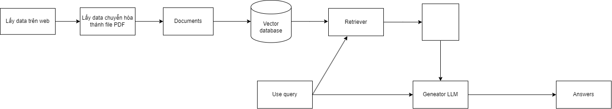
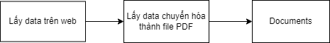
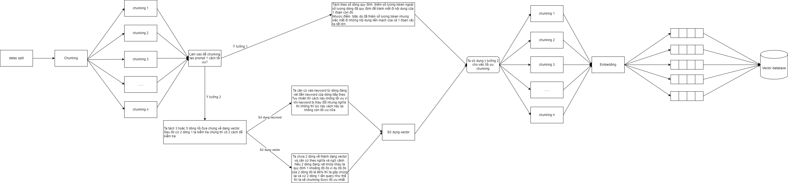
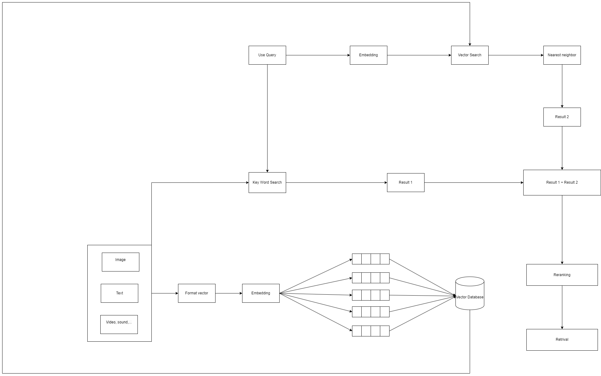

# Bài toán: Xây dựng Chatbot hỏi đáp thông tin từ silde của AIO.
# Tổ chức dự án
```bash
📦 ChatbotAIO
 ┣ 📂 Chunking # Module để chunking data
    ┗ __pycache__ 
    ┗ __init__.py # Khởi tạo lên package  
    ┗ Chunking.py # Khởi tạo lên class dùng cho việc chunking
 ┣ 📂 Get_datas # Module để chunking data
    ┗ __pycache__ 
    ┗ __init__.py # Khởi tạo lên package
    ┗ Get_datas.py # Khởi tạo lên class dùng cho việc đọc dữ liệu chuyển thành file text
 ┣ 📂 Image # Folder chứa ảnh cho các ý tưởng
    ┗ Embedding_Retrival.png # Ảnh biểu diễn quá trình Embedding để đưa vào Vector database 
    ┗ Get_Data.png # Ảnh biểu diễn quá trình lấy data và chuyển thành Documents 
    ┗ ID_RAG.png # Ảnh biểu diễn ý tưởng của dự án 
    ┗ Vector_Datababse.png # Ảnh biểu diễn quá trình chia dữ liệu để chuyển hóa vào Vector databse
 ┣ 📂 code # Folder đầu tiên được khởi tạo để lưu file code trung tâm của dự án
    ┗ Build_RAG.ipynb # File code trung tâm của dự án
 ┣  README.md # File mô tả giới thiệu dự án 
 ┣  setup.txt # File chứa các gói package cần cài đặt trước khi chạy chương trình  
```





