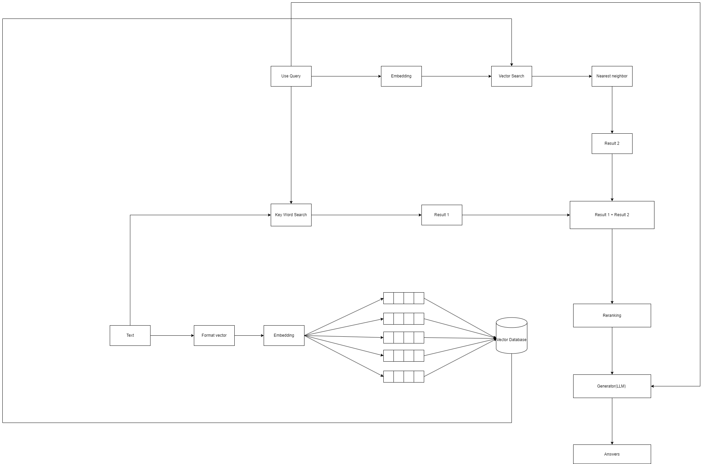
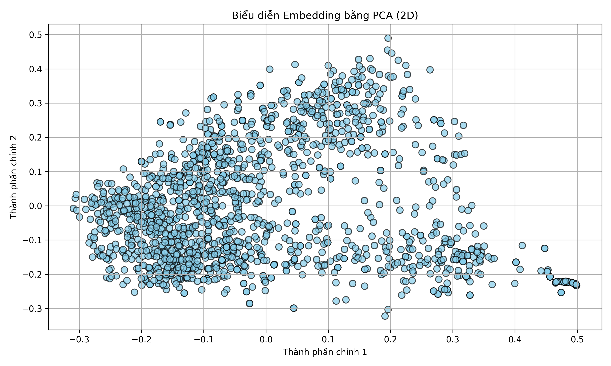
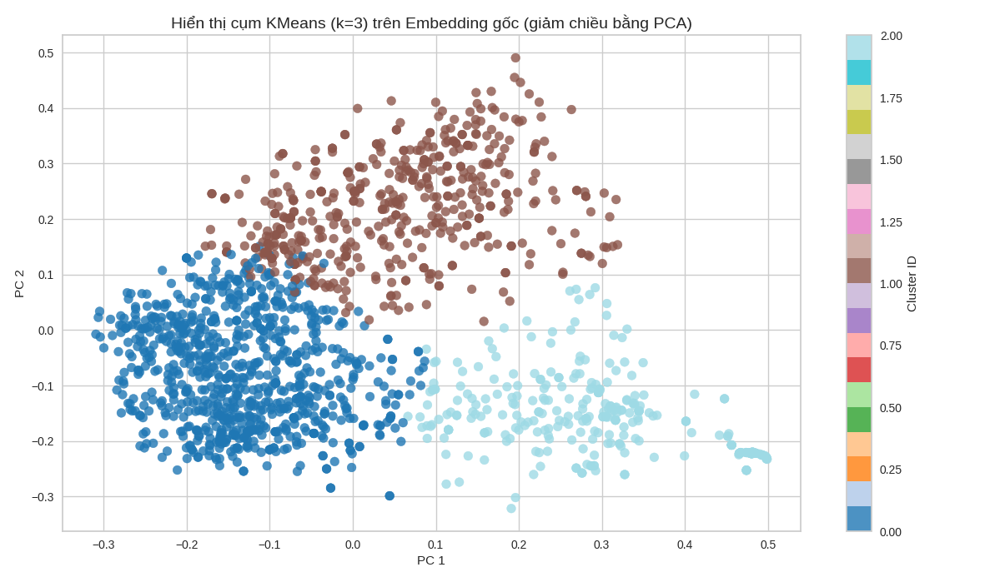

# Dự án: Xây dựng Chatbot hỏi đáp các câu hỏi liên quan đến AI.
## Giới thiệu: Dự án do tôi làm nhằm mục đích giúp mọi người có thể hỏi đáp các câu hỏi về AI một cách thuận tiện hơn.
# Các công nghệ sử dụng.
Tôi sử dụng kỹ thuật RAG. 
Sử dụng KMeans để phân cụm dữ liệu.
# Tổ chức dự án
```bash
📦 ChatbotAIO
 ┣ 📂 Chunking # Module để chunking data
    📂 __pycache__ 
    ┗ __init__.py # Khởi tạo lên các class để chunking  
 ┣ 📂 data # Folder lưu file PDF
 ┣ 📂 Embedding_Retrival # Module để Embedding -> Retrival
    📂 __pycache__ 
    ┗ __init__.py # Khởi tạo lên các class để Embedding -> Retrival
 ┣ 📂 Get_datas # Module để lấy data
    📂 __pycache__ 
    ┗ __init__.py # Khởi tạo lên các class để lấy data và chuyển thành text lưu dưới dạng danh sách
 ┣ 📂 Image # Folder chứa ảnh cho các ý tưởng
    ┗ Embedding_Retrival.png # Ảnh biểu diễn quá trình Embedding để đưa vào Vector database 
    ┗ Get_Data.png # Ảnh biểu diễn quá trình lấy data và chuyển thành Documents 
    ┗ ID_RAG.png # Ảnh biểu diễn ý tưởng của dự án 
    ┗ Vector_Datababse.png # Ảnh biểu diễn quá trình chia dữ liệu để chuyển hóa vào Vector databse
 ┣  README.md # File mô tả giới thiệu dự án 
 ┣  main.ipynb # File code trung tâm của dự án
 ┣  setup.txt # File chứa các gói package cần cài đặt trước khi chạy chương trình  
```
# Ý tưởng sử dụng RAG.

# Quá trình data và chuyển thành Documents.

# Quá trình tách văn bản Embedding để đưa vào Vector database.

# Quá trình Embedding để tiến hành Retrival.

# Trực quan hóa dữ liệu.

# Ý tưởng tối ưu cho hệ thống RAG bằng KMeans để tăng tốc độ truy vấn.
Ta phân cụm dữ liệu ở đây nhìn từ biểu đồ có thể thấy phân làm 3 cụm sẽ hợp lý.

Sau đó ta sẽ lưu các center point vào trong vector database và lưu nhãn kèm theo các điểm thuộc nhãn đấy rồi lưu vào file json.
